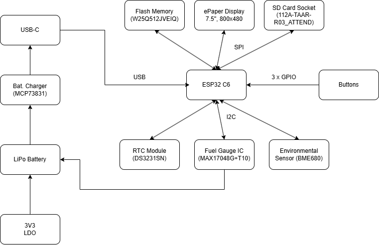

# Diagrama Bloc

# Bill of Materials

| Componenta | Descriere | Cumpara | Datasheet |
|------------|-----------|----------------|--------------|
| ESP32-C6-WROOM-1-N8 | Microcontroler cu Wi-Fi 6, BLE 5.0 | [Mouser](https://ro.mouser.com/ProductDetail/Espressif-Systems/ESP32-C6-WROOM-1-N8) | [Datasheet](https://www.espressif.com/sites/default/files/documentation/esp32-c6-wroom-1_wroom-1u_datasheet_en.pdf) |
| BME680 | Senzor temperatură, umiditate, presiune, VOC | [Mouser](https://ro.mouser.com/ProductDetail/Bosch-Sensortec/BME680) | [Datasheet](https://www.bosch-sensortec.com/media/boschsensortec/downloads/datasheets/bst-bme680-ds001.pdf) |
| DS3231SN | Ceas în timp real | [Mouser](https://ro.mouser.com/ProductDetail/Analog-Devices/DS3231SN) | [Datasheet](https://www.analog.com/media/en/technical-documentation/data-sheets/DS3231.pdf) |
| W25Q512JVEIQ | Memorie Flash 64MB | [Mouser](https://ro.mouser.com/ProductDetail/Winbond/W25Q512JVEIQ) | [Datasheet](https://www.winbond.com/resource-files/W25Q512JV%20SPI%20RevB%2006252019%20KMS.pdf) |
| MicroSD Slot (112A-TAAR-R03) | Slot card microSD | [Mouser](https://ro.mouser.com/ProductDetail/Attend/112A-TAAR-R03) | [Datasheet](https://www.attend.com.tw/data/download/file/112A-TAAR-R03_Spec.pdf) |
| MCP73831T-5ACI/OT | Încărcător baterie | [Mouser](https://ro.mouser.com/ProductDetail/Microchip-Technology/MCP73831T-5ACI-OT) | [Datasheet](https://ww1.microchip.com/downloads/en/DeviceDoc/MCP73831-Family-Data-Sheet-DS20001984H.pdf) |
| MAX17048G+T10 | Indicator nivel baterie | [Mouser](https://ro.mouser.com/ProductDetail/Analog-Devices/MAX17048G%2BT10) | [Datasheet](https://www.analog.com/media/en/technical-documentation/data-sheets/MAX17048-MAX17049.pdf) |
| XC6220A331MR-G | Regulator 3.3V | [Mouser](https://ro.mouser.com/ProductDetail/Torex-Semiconductor/XC6220A331MR-G) | [Datasheet](https://www.torexsemi.com/file/xc6220/XC6220.pdf) |
| USB4110-GF-A | Conector USB-C | [Mouser](https://ro.mouser.com/ProductDetail/GCT/USB4110-GF-A) | [Datasheet](https://gct.co/files/drawings/usb4110.pdf) |
| CPH3225A | Supercondensator pentru ceas | [Mouser](https://ro.mouser.com/ProductDetail/Seiko-Instruments/CPH3225A) | [Datasheet](https://mm.digikey.com/Volume0/opasdata/d220001/medias/docus/6537/rev05-CPHCPM.pdf) |
| DMG2305UX-7 | MOSFET P-Channel | [Mouser](https://ro.mouser.com/ProductDetail/Diodes-Incorporated/DMG2305UX-7) | [Datasheet](https://www.diodes.com/assets/Datasheets/DMG2305UX.pdf) |
| SI1308EDL-T1-GE3 | MOSFET N-Channel | [Mouser](https://ro.mouser.com/ProductDetail/Vishay-Siliconix/SI1308EDL-T1-GE3) | [Datasheet](https://www.vishay.com/docs/63399/si1308edl.pdf) |
| USBLC6-2SC6Y | Protecție ESD USB | [Mouser](https://ro.mouser.com/ProductDetail/STMicroelectronics/USBLC6-2SC6Y) | [Datasheet](https://www.st.com/resource/en/datasheet/usblc6-2.pdf) |
| PGB1010603MR | Protecție ESD | [Mouser](https://ro.mouser.com/ProductDetail/Littelfuse/PGB1010603MR) | [Datasheet](https://www.littelfuse.com/~/media/electronics/datasheets/esd_protection/littelfuse_pulseguard_esd_pgb1_series_datasheet.pdf) |
| BD5229G-TR | Detector tensiune | [Mouser](https://ro.mouser.com/ProductDetail/ROHM-Semiconductor/BD5229G-TR) | [Datasheet](https://fscdn.rohm.com/en/products/databook/datasheet/ic/power/voltage_detector/bd52xxg-e.pdf) |
| FH34SRJ-24S-0.5SH(99) | Conector FFC/FPC e-paper | [Mouser](https://ro.mouser.com/ProductDetail/Hirose-Connector/FH34SRJ-24S-0.5SH99) | [Datasheet](https://www.hirose.com/product/document?clcode=&productname=&series=FH34SRJ&documenttype=Catalog&lang=en) |
| 744043680 | Inductor | [Mouser](https://ro.mouser.com/ProductDetail/Wurth-Elektronik/744043680) | [Datasheet](https://www.we-online.com/components/products/datasheet/744043680.pdf) |
| EVQPUJ02K | Buton tactil | [Mouser](https://ro.mouser.com/ProductDetail/Panasonic/EVQPUJ02K) | [Datasheet](https://www.lcsc.com/datasheet/lcsc_datasheet_2201121800_PANASONIC-EVQPUJ02K_C2936858.pdf) |
| KP-1608SURCK | LED indicator | [Mouser](https://ro.mouser.com/ProductDetail/Kingbright/KP-1608SURCK) | [Datasheet](https://media.elv.com/file/107153_led_surck1608_data.pdf) |

# Functionalitati Hardware
### ESP32-C6-WROOM-1-N8
- MCU principal, Wi-Fi 6, Bluetooth 5
- Interfețe: SPI, I2C, UART, GPIO
- 160MHz, 512KB SRAM, 8MB Flash

### Senzor BME688
- Măsoară: temperatură, umiditate, presiune, VOC
- I2C, consum redus: <1mA

### Ecran E-Paper
- Diagonală: 7.5”
- Conectare prin SPI
- Consum 0 în stare statică

### Sistem de Alimentare
- Baterie: 3.7V Li-Po 2500mAh
- Încărcare: MCP73831, max 1A
- Monitorizare: MAX17048 (Fuel Gauge)
- Consum tipic:
- Activ: ~150mA
- Standby: ~10mA
- Deep Sleep: <50µA
- Autonomie: ~250h la 10mA

### Conectivitate USB-C
- Încărcare & date (USB 2.0)
- Protecție ESD: USBLC6-2SC6Y

# Descriere pini

| Pin  | Funcție        | Componentă          | Descriere Utilizare           |
|-----:|:---------------|:--------------------|:------------------------------|
| EN  | RESET    | Resetare sistem               |Pin pentru resetare
| GPIO0  | BOOT_BUTTON    | Buton               | Boot mode la pornire          |
| GPIO1  | RESET_BUTTON   | Buton               | Reset manual                  |
| GPIO2  | CHANGE_BUTTON  | Buton               | Navigare meniu                |
| GPIO3  | EPD_CS         | Display E-Paper     | Chip Select (SPI)             |
| GPIO4  | EPD_DC         | Display E-Paper     | Data/Command control          |
| GPIO5  | EPD_RST        | Display E-Paper     | Reset ecran                   |
| GPIO6  | EPD_BUSY       | Display E-Paper     | Semnal stare refresh          |
| GPIO7  | SPI_MOSI       | Display, Flash, SD  | Master Out Slave In (SPI)     |
| GPIO8  | SPI_MISO       | Display, Flash, SD  | Master In Slave Out (SPI)     |
| GPIO9  | SPI_SCK        | Display, Flash, SD  | Clock SPI                     |
| GPIO10 | FLASH_CS       | W25Q512JVEIQ        | Chip Select pentru Flash      |
| GPIO11 | SD_CS          | Micro SD (opțional) | Chip Select card SD           |
| GPIO12 | I2C_SDA        | BME680, MAX17048, DS3231 | Linie date I2C          |
| GPIO13 | I2C_SCL        | BME680, MAX17048, DS3231 | Linie clock I2C         |    
| GPIO14 | CHG_LED        | LED încărcare       | Status încărcare              |
| GPIO15 | UART_TX        | Debugging           | TX serial                     |
| GPIO16 | UART_RX        | Debugging           | RX serial                     |
| GPIO17 | USB_D+         | USB-C               | Linie date USB +              |
| GPIO18 | USB_D-         | USB-C               | Linie date USB – 
| GPIO21   | SDA          | Linie date I²C                   | Comun pentru senzori si RTC            |
| GPIO22   | SCL          | Linie ceas I²C                   | Semnal comun de ceas I²C               |
| GPIO23   | EPD_RST      | Resetare e-paper                 | Resetare hardware pentru afișaj        |
| TXD0   | TX           | Transmitere UART (depanare)      | Punct test pentru depanare             |
| RXD0   | RX           | Recepție UART (depanare)         | Punct test pentru depanare             |   |

## observatii:
- fisierul Mechanical si Images nu au fost inca populate
- componentele SPI ESD Protection Lines sunt foarte grupate
- toate test pad-urile sunt pe pcb, desi in model doar 5 erau
